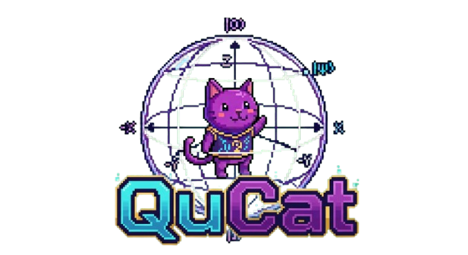

# Grupo 1 - Hackaton QuantumHub Winter School



## Integrantes

- Piero Sayd Montero Marreros 
- Adrian Alejandro Leon Ojeda
- Andres Joshua Canahuire Taboada
- Mathias Manuel Emilio Canales Diaz

## Problema Identificado

Existe una falta de democratización en la computación cuánticas, especialmente para niños y estudiantes de secundaria con pocos recursos y con poco conocimiento previo en física o matemáticas. Esto reduce el interés en áreas de la ciencia y la tecnología.

## Descripción de la solución

El producto de nuestro proyecto es el videojuego QuCat, una propuesta educativa diseñada para fomentar la democratización de la computación cuántica en un público joven, principalmente niños y adolescentes de secundaria, con bajos recursos y poco conocimiento sobre física y matemáticas.

En QuCat, el jugador controla a un gato dentro de una esfera de Bloch, la cual representa el estado de un qubit. El objetivo es recolectar las compuertas cuánticas que caen para modificar el estado del qubit y alcanzar el estado objetivo. Por ejemplo, el jugador puede comenzar en el estado $|0\rangle$ y necesitar colapsar a 1. Para lograrlo, debe combinar adecuadamente compuertas como H, X, Y, Z, S y T para aumentar la probabilidad de colapsar al estado correcto.

A través de esta mecánica, el jugador aprende de forma visual e interactiva cómo las compuertas cuánticas afectan el estado de un qubit, cómo se forma la superposición y cómo ocurre el colapso al medir el sistema. Además, el juego cuenta con una interfaz que permite visualizar el estado actual del qubit mediante las amplitudes de los estados $|0\rangle$ y $|1\rangle$, las probabilidades de colapsar en cada uno de ellos y el puntaje actual.

El sistema de juego está diseñado para reforzar estos conceptos de manera dinámica: el jugador obtiene 1 punto cuando logra colapsar al estado objetivo y pierde 1 punto si colapsa al estado contrario. Asimismo, gana cuando alcanza 5 puntos y pierde cuando llega a -5 puntos.

## Estructura de proyecto

```text
Grupo1-HackatonQhubWinterS/
├── main.py                                  # Bucle principal del juego y flujo general
├── superposicion.py                         # Lógica cuántica para aplicar compuertas y colapsar el qubit
├── configuracion.py                         # Constantes globales del proyecto
├── assets.py                                # Carga y limpieza de imágenes y sprites
├── ui.py                                    # Funciones de interfaz y paneles del menú/instrucciones
├── formato_qubit.py                         # Formateo del estado del qubit para mostrar amplitudes
├── requirements.txt                         # Dependencias de Python del proyecto
├── README.md                                # Documentación del proyecto
├── LICENSE                                  # Licencia del repositorio
├── .gitignore                               # Archivos ignorados por Git
├── .vscode/                                 # Configuración del entorno de VS Code
│
├── img/                                     # Activos gráficos del juego
│   ├── fondo.jpeg
│   ├── suelo.jpeg
│   ├── cat.png
│   ├── medidor.jpeg
│   ├── QuCatTitulo.png
│   ├── titulo_victoria.png
│   ├── titulo_derrota.png
│   └── compuerta_*.png / .jpeg              # Imágenes de las compuertas cuánticas
│
└── sfx/                                     # Sonidos del videojuego
    ├── get_gate.mp3.mpeg
    ├── pixel_jump_sound.mp3.mpeg
    ├── medicion.mp3.mpeg
    ├── victoria.mp3.mpeg
    └── game_over.mp3.mpeg
```

## Requisitos

Para ejecutar este proyecto en Python, se requieren las siguientes dependencias:

- `pygame`
- `qiskit`

Puede instalarse todo con el siguiente comando:

```bash
pip install -r requirements.txt
```